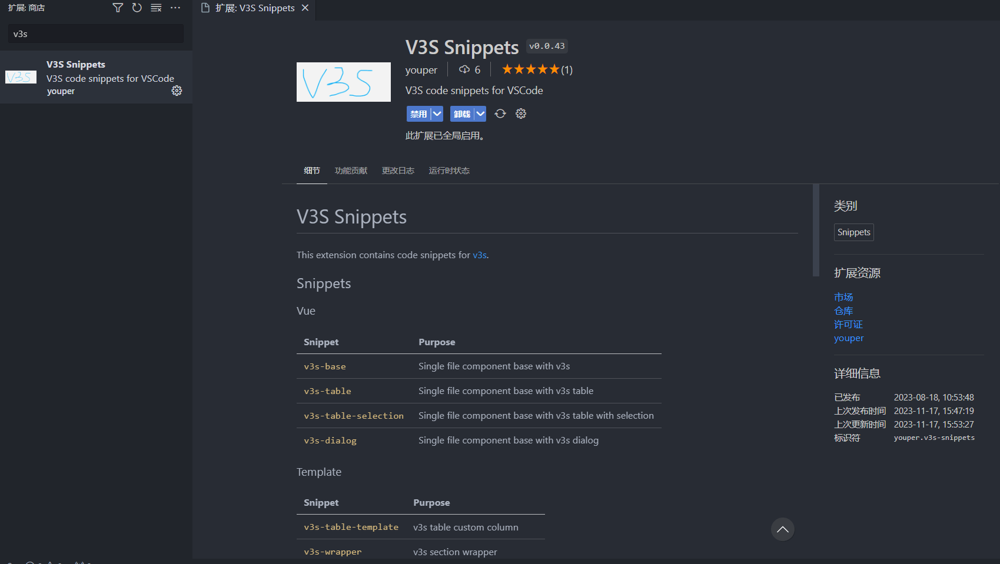

# V3S Snippets

This extension contains code snippets for [v3s](https://github.com/wangyupo/v3s).

From the extension of vscode, search for "v3s snippets" and install it to use it.

## Snippets

### Vue

| Snippet               | Purpose                                                  |
| --------------------- | -------------------------------------------------------- |
| `v3s-base`            | Single file component base with v3s                      |
| `v3s-table`           | Single file component base with v3s table                |
| `v3s-table-selection` | Single file component base with v3s table with selection |
| `v3s-dialog`          | Single file component base with v3s dialog               |

### Template

| Snippet              | Purpose                       |
| -------------------- | ----------------------------- |
| `v3s-table-template` | v3s table custom column       |
| `v3s-wrapper`        | v3s section wrapper           |
| `v3s-scr`            | scope.row directive           |
| `v3s-loading`        | v-loading="loading" directive |
| `v3s-assets`         | @/assets/path                 |

### Script

| Snippet               | Purpose                                                   |
| --------------------- | --------------------------------------------------------- |
| `v3s-usedialog`       | import dialog and create logic code                       |
| `v3s-useelform`       | create el-form logic code                                 |
| `v3s-usemessagebox`   | import ElMessage, ElMessageBox and create use demo        |
| `v3s-elmsg`           | create ElMessage template code                            |
| `v3s-imdapi`          | create code `import {} from "@/api/xx.js"`                |
| `v3s-imdutils`        | create code `import {} from "@/utils/xx.js";`             |
| `v3s-imdhooks`        | create code `import {} from "@/hooks/xx.js";`             |
| `v3s-loading`         | create loading related code                               |
| `v3s-cfn`             | create an arrow function with functional annotation       |
| `v3s-defineProps`     | create defineProps code                                   |
| `v3s-defineEmits`     | create defineEmits code                                   |
| `v3s-router`          | import useRouter and create router logic code             |
| `v3s-api`             | create api logic code                                     |
| `v3s-params`          | create code `const params = {}`                           |
| `v3s-code200`         | create code`if (res.code === 200) {}`                     |
| `v3s-usepinia`        | import a pinia store and use it                           |
| `v3s-reactive`        | create code `const param = reactive({});`                 |
| `v3s-computed`        | create code `const param = computed(() => { return });`   |
| `v3s-watch`           | create code `watch(() => param, (newVal, oldVal) => {});` |
| `v3s-watch-array`     | create code watch two more params                         |
| `v3s-watcheffect`     | create code `watchEffect(() => {});`                      |
| `v3s-ref`             | create code `const param = ref();`                        |
| `v3s-onmounted`       | create code `onMounted(() => {});`                        |
| `v3s-onbeforemount`   | create code `onBeforeMount(() => {});`                    |
| `v3s-onbeforeupdate`  | create code `onBeforeUpdate(() => {});`                   |
| `v3s-onupdated`       | create code `onUpdated(() => {});`                        |
| `v3s-onerrorcaptured` | create code `onErrorCaptured(() => {});`                  |
| `v3s-onunmounted`     | create code `onUnmounted(() => {});`                      |
| `v3s-onbeforeunmount` | create code `onBeforeUnmount(() => {});`                  |
| `v3s-nextTick`        | create code `nextTick(() => {});`                         |

### scss

| Snippet | Purpose    |
| ------- | ---------- |
| `:dp`   | :deep() {} |

## Release Notes

See [Change Log](https://github.com/wangyupo/V3S-Snippets/blob/main/CHANGELOG.md).

---

## License

[MIT © Richard McRichface.](https://github.com/wangyupo/V3S-Snippets/blob/main/LICENSE)
