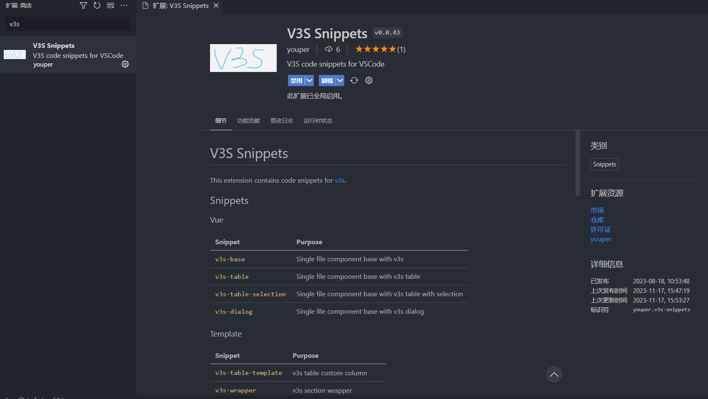
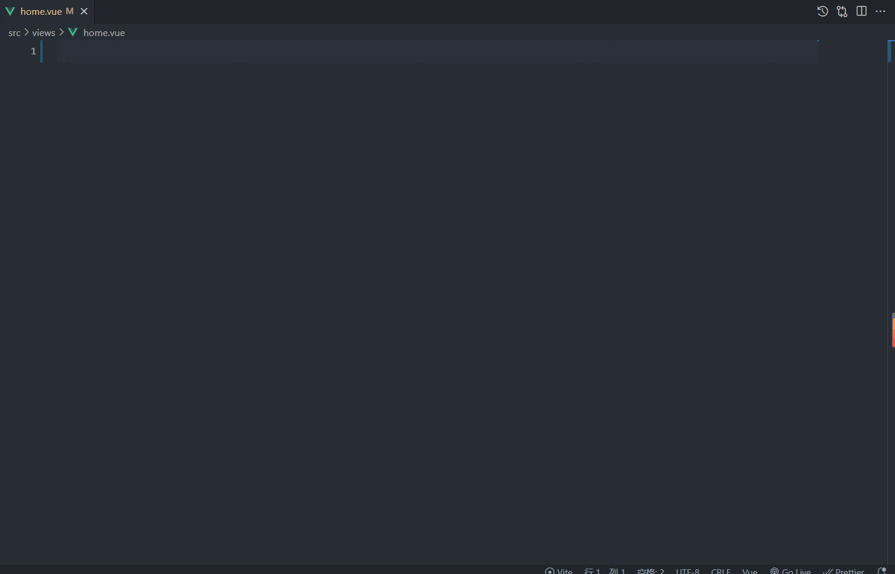
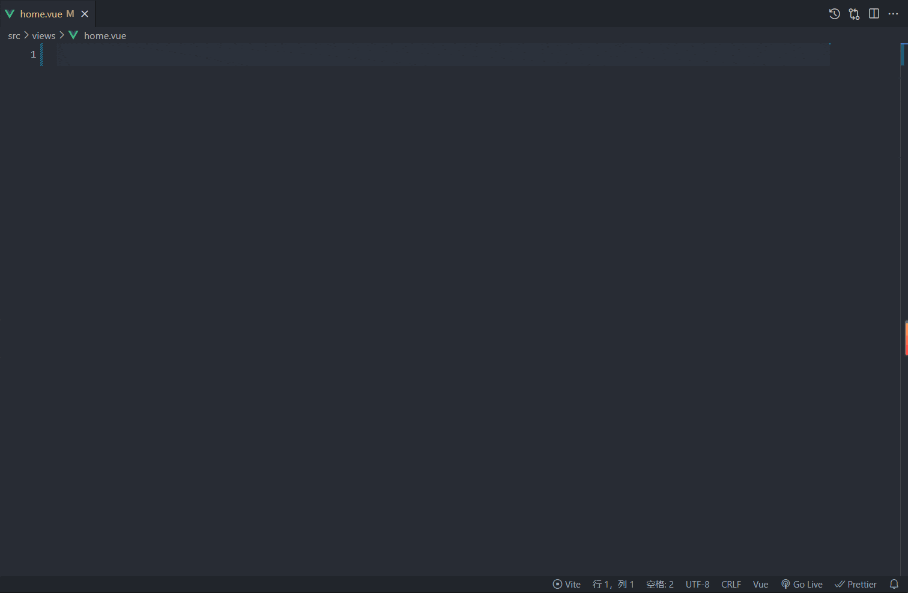
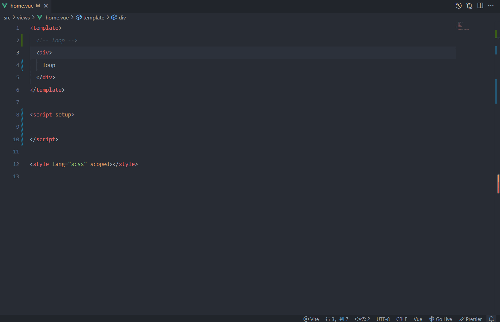
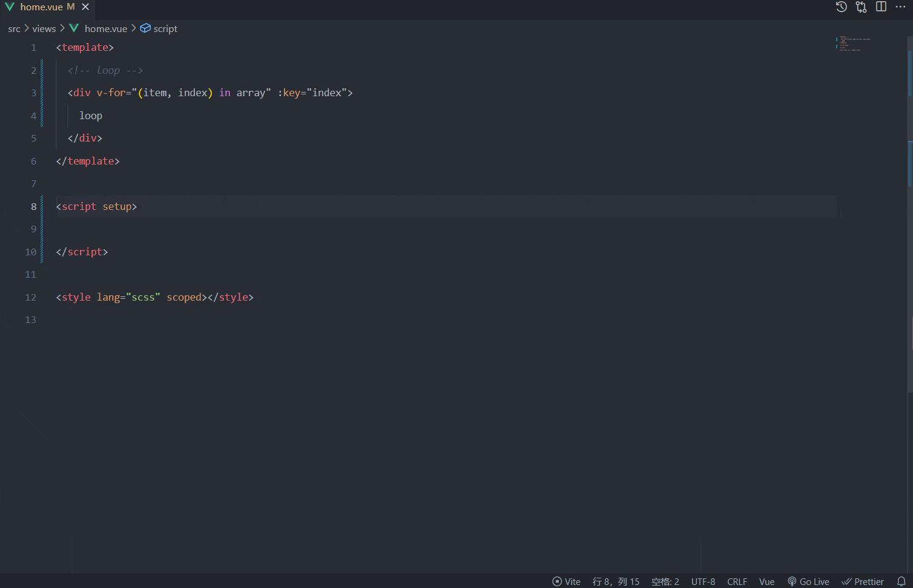

# V3S Snippets

This extension contains code snippets for [v3s](https://github.com/wangyupo/v3s).

Vue 3 + Element Plus + Pinia 代码片段，快速生成常用代码模板。

## 安装

在 VSCode 扩展商店搜索 **"V3S Snippets"** 并安装即可使用。

## 使用示例

`v3s-base`

`v3s-table`

`v3s-v-for`

`v3s-imdapi`

## Snippets

### Vue

| Snippet                           | Purpose                                                          |
| --------------------------------- | ---------------------------------------------------------------- |
| `v3s-base`                        | Single file component base with v3s                              |
| `v3s-table`                       | Single file component base with v3s table                        |
| `v3s-table-selection`             | Single file component base with v3s table with selection         |
| `v3s-dialog`                      | Single file component base with v3s dialog                       |
| `v3s-dialog-form`                 | Single file component base with v3s dialog with form (auto reset)|
| `v3s-dialog-operate`              | Single file component base with v3s dialog for add/edit operations|
| `v3s-echart-line`                 | Single file component base with v3s echarts line                 |
| `v3s-echart-bar`                  | Single file component base with v3s echarts bar                  |
| `v3s-echart-bar-horizontal`       | Single file component base with v3s echarts bar horizontal       |
| `v3s-echart-bar-stack`            | Single file component base with v3s echarts stack bar            |
| `v3s-echart-bar-stack-horizontal` | Single file component base with v3s echarts stack bar horizontal |
| `v3s-echart-pie`                  | Single file component base with v3s echarts pie                  |
| `v3s-echart-pie-nightingale`      | Single file component base with v3s echarts nightingale pie      |

### Template

| Snippet              | Purpose                                                               |
| -------------------- | --------------------------------------------------------------------- |
| `v3s-table-template` | v3s table custom column                                               |
| `v3s-wrapper`        | v3s section wrapper `RhWrapper title="示例标题"></RhWrapper>`         |
| `v3s-scr`            | scope.row directive                                                   |
| `v3s-loading`        | v-loading="loading" directive                                         |
| `v3s-assets`         | create code `@/assets/path`                                           |
| `v3s-template`       | create code `<template></template>`                                   |
| `v3s-template-slot`  | create code `<template #slot-name></template>`                        |
| `v3s-v-for`          | create code `v-for="(item, index) in array" :key="index"`             |

### Template - Element Plus

| Snippet              | Purpose                                        |
| -------------------- | ---------------------------------------------- |
| `v3s-el-btn`         | el-button with type options                    |
| `v3s-el-btnlink`     | el-button link with type options               |
| `v3s-el-input`       | el-input                                       |
| `v3s-el-select`      | el-select with el-option                       |
| `v3s-el-radio`       | el-radio-group (with script comment)           |
| `v3s-el-checkbox`    | el-checkbox-group (with script comment)        |

### Script

| Snippet               | Purpose                                                   |
| --------------------- | --------------------------------------------------------- |
| `v3s-usedialog`       | import dialog and create logic code                       |
| `v3s-useelform`       | create el-form logic code                                 |
| `v3s-elmsg`           | create ElMessage template code                            |
| `v3s-elicon`          | create code `import {} from "@element-plus/icons-vue";`   |
| `v3s-imdapi`          | create code `import {} from "@/api/xx.js"`                |
| `v3s-imdutils`        | create code `import {} from "@/utils/xx.js";`             |
| `v3s-imdhooks`        | create code `import {} from "@/hooks/xx.js";`             |
| `v3s-imdenums`        | create code `import {} from "@/enums/xx.js";`             |
| `v3s-loading`         | create loading related code                               |
| `v3s-cfn`             | create an arrow function with functional annotation       |
| `v3s-cfn-debounce`    | create a debounced arrow function                         |
| `v3s-scr`             | create code `scope.row`                                   |
| `v3s-defineProps`     | create defineProps code                                   |
| `v3s-prop`            | append a prop to existing defineProps                     |
| `v3s-defineEmits`     | create defineEmits code                                   |
| `v3s-useEmits`        | create emits() call code                                  |
| `v3s-router`          | import useRouter and create router logic code             |
| `v3s-route`           | import useRoute and create route code                     |
| `v3s-api`             | create api logic code                                     |
| `v3s-fetchapi`        | create api call with function wrapper                     |
| `v3s-fetchapi-async`  | create api call with async function wrapper               |
| `v3s-api-curd`        | create api curd code                                      |
| `v3s-params`          | create code `const params = {}`                           |
| `v3s-code200`         | create code `if (res.code == 200) {}`                     |
| `v3s-usepinia`        | import a pinia store and use it                           |
| `v3s-usepinia-patch`  | create pinia $patch code                                  |
| `v3s-pinia`           | create pinia store file                                   |
| `v3s-reactive`        | create code `const param = reactive({});`                 |
| `v3s-computed`        | create code `const param = computed(() => { return });`   |
| `v3s-watch`           | create code `watch(() => param, (newVal, oldVal) => {});` |
| `v3s-watch-array`     | create code watch two more params                         |
| `v3s-watcheffect`     | create code `watchEffect(() => {});`                      |
| `v3s-ref`             | create code `const param = ref();`                        |
| `v3s-onmounted`       | create code `onMounted(() => {});`                        |
| `v3s-onbeforemount`   | create code `onBeforeMount(() => {});`                    |
| `v3s-onbeforeupdate`  | create code `onBeforeUpdate(() => {});`                   |
| `v3s-onupdated`       | create code `onUpdated(() => {});`                        |
| `v3s-onerrorcaptured` | create code `onErrorCaptured(() => {});`                  |
| `v3s-onunmounted`     | create code `onUnmounted(() => {});`                      |
| `v3s-onbeforeunmount` | create code `onBeforeUnmount(() => {});`                  |
| `v3s-nextTick`        | create code `nextTick(() => {});`                         |
| `v3s-defineExpose`    | create code `defineExpose({});`                           |
| `v3s-anfn`            | create arrow function                                     |
| `v3s-backfillFormByPropsData` | backfill form by props data                       |

### SCSS / CSS

| Snippet        | Purpose                             |
| -------------- | ----------------------------------- |
| `deep` / `dp`  | `:deep() {}` 样式穿透               |
| `fc`           | flex center 居中布局                |
| `fb`           | flex space-between 两端对齐         |
| `ell`          | 单行文本省略                        |
| `ellm`         | 多行文本省略                        |
| `abc`         | 绝对定位居中                        |
| `abf`         | 绝对定位铺满                        |
| `bef`          | ::before 伪元素                     |
| `aft`          | ::after 伪元素                      |

## Release Notes

See [CHANGELOG](https://github.com/wangyupo/V3S-Snippets/blob/main/CHANGELOG.md).

---

## License

[MIT © youper](https://github.com/wangyupo/V3S-Snippets/blob/main/LICENSE)
